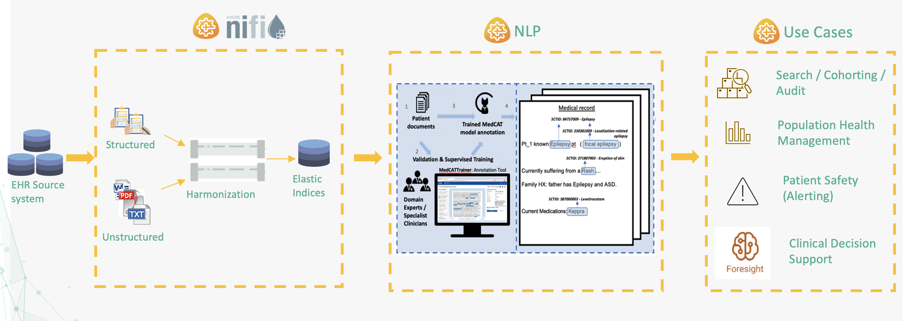
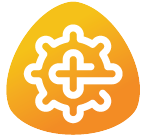
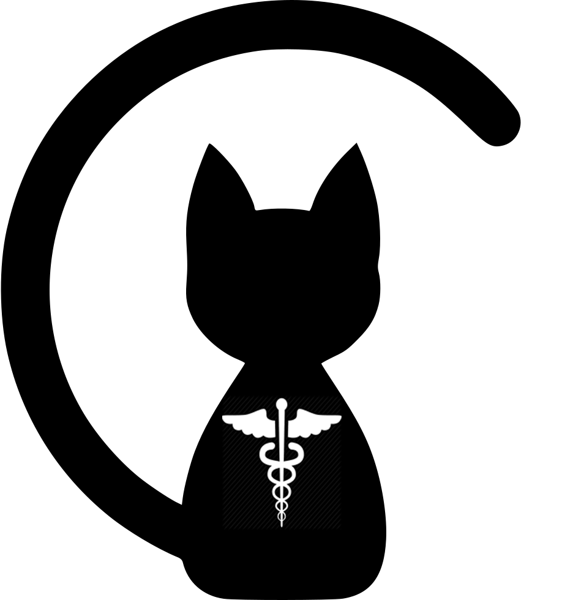

# Cogstack Documentation

Welcome to the CogStack Documentation site.

Get started by looking at the [CogStack Overview](overview/cogstack-documentation.md)

Any broad questions then please do reach out in our community space [here](https://discourse.cogstack.org/)

Further in development projects are [here](https://github.com/orgs/CogStack/repositories)



| Tool | Description |
|:-----|:------------|
| {width=100} <br/> [**CogStack-Nifi**](https://cogstack-nifi.readthedocs.io/en/latest/main.html) | Data flow orchestration using Apache NiFi |
| {width=100} <br/> [**MedCAT**](https://medcat.readthedocs.io/en/latest/) | Medical Concept Annotation Toolkit |
| {width=100} <br/> [**MedCATTrainer**](https://medcattrainer.readthedocs.io/en/latest/) | Web-based annotation and training interface for MedCAT |


```{toctree}
:hidden:
:maxdepth: 5
overview/_index

```

```{toctree}
:hidden:
:caption: CogStack NLP
MedCAT <https://docs.cogstack.org/projects/nlp>
MedCAT Trainer <https://docs.cogstack.org/projects/medcat-trainer/>

```

```{toctree}
:hidden:
:caption: CogStack Platform

NiFi <https://docs.cogstack.org/projects/nifi/>

platform/_index
```

