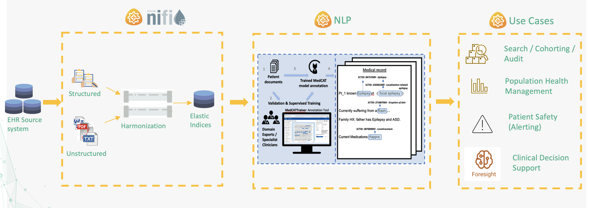
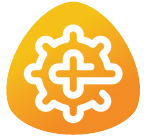

# CogStack Product Documentation

Welcome to the CogStack Documentation site.

Any broad questions then please do reach out in our community space [here](https://discourse.cogstack.org/)

Further in development projects are [here](https://github.com/orgs/CogStack/repositories)

|                                                                                                                                             |                                                                                                                             |
|:--------------------------------------------------------------------------------------------------------------------------------------------|:----------------------------------------------------------------------------------------------------------------------------|
| [CogStack-Nifi](https://cogstack-nifi.readthedocs.io/en/latest/main.html)   | [MedCAT](https://medcat.readthedocs.io/en/latest/)      ||                                                                                                                                    |       |
|:-----------------------------------------------------------------------------------------------------------------------------------|:------|
| [MedCATTrainer](https://medcattrainer.readthedocs.io/en/latest/)   |   |
