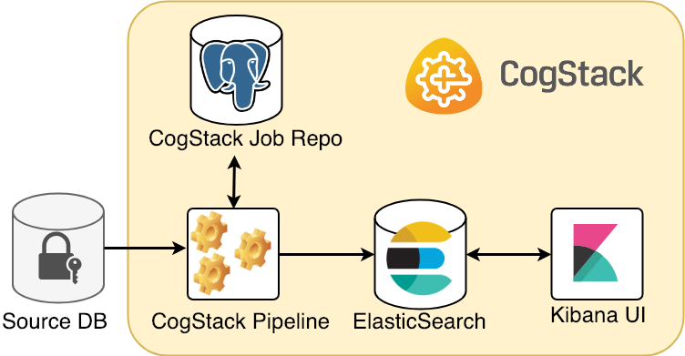

# CogStack ecosystem (v1)

In this part are covered the available services that can be running in an example CogStack deployment. To such deployment with many running services we refer as an  *ecosystem* or a *platform*. Below is presented a high-level perspective of CogStack platform with the possibilities it enables through many components and services. In practice, many of the functionalities that CogStack platform enables are implemented as separate, but interconnected services working inside the ecosystem. 

## Core services

In most scenarios CogStack platform will consist of *core* services tailored to specific use-cases. Additional application and services can be run on top of it, such as [SemEHR](../../CogStack%20General/CogStack%20Wiki/CogStack%20projects/SemEHR.md), [Patient Timeline](../../CogStack%20General/CogStack%20Wiki/CogStack%20projects/Patient%20Timeline.md), Live Alerting (through ElasticSearch plugins) or any other custom developed applications. For an ease-of-use, when deploying a sample CogStack platform, we always emphasise to use Docker Compose (see: [Running CogStack](Running%20CogStack.md)).

Below is presented is one of the most simple and common scenarios when ingesting and processing the EHR data from a proprietary data source.

A CogStack platform presented here consists of such core services:

- *CogStack Pipeline* service for ingesting and processing the EHR data from the source database,
- *CogStack Job Repository* (PostgreSQL database) serving for job status control,
- *ElasticSearch* sink where the processed EHR records are stored,
- (optional) *Kibana* user interface to easily perform exploratory data analysis over the processed records.

It is essential to note that presented is a very simplified scenario, which can be easily deployed even on a local machine with limited resources. We are also using here an optional Kibana as an out-of-the-box and easy to use solution to explore the data, although many other data analysis or BI tools can be used. Moreover, there are also available connectors to ElasticSearch in many languages, such as Java, Python, R or JavaScript allowing for fast development of custom user applications.

:::{tip}
Note
 
In the picture we only presented ElasticSearch using a single node. However, in practice, one should consider using at least 3 asticSearch nodes deployed as a cluster which greatly improves resilience, query performance and reliability.
Similarly, in the picture we only presented one CogStack Pipeline instance and only one data source. However, in practice, there may be multiple sources available with multiple Pipeline components running in parallel. This is why, when considering deploying CogStack platform in production, one should keep in mind the aspects of the scalability and resilience of the platform and running services.
:::

### CogStack Pipeline

CogStack Pipeline is the main data processing service used inside the CogStack platform. Within the ecosystem it's main responsibilities is to ingest the EHR data from a specified data source, process the data (e.g. by applying the text extraction methods, records de-identification or extracting the NLP annotations) and store the resulting data in the specified sink.

Usually, the sink will be the ElasticSearch store, keeping the processed EHRs which can be ready to use by other applications. However, when performing computationally-expensive processing tasks, such as running OCR-based text extraction from the documents, one may prefer to store the partial results in a cache. In such case, PostgreSQL can be used as a temporary store – [Examples](Examples.md) covers such case.

The information about available data processing components offered by CogStack Pipeline can be found in [CogStack Pipeline](CogStack%20Pipeline.md) part.

:::{ifno}
We recommend using CogStack Pipeline component in the newest version 1.3.0.
:::

---

---

### PostgreSQL

[PostgreSQL](https://www.postgresql.org/) is a widely used object-relational database management system. In CogStack platform it is primarily used as a job repository, for storing the jobs execution status of running CogStack Pipeline instances. However, there may be cases where one may need to store the partial results treating PostgreSQL DB either as a data cache (see: [Examples](Examples.md) ) or an auxiliary data sink.

When used as a job repository, it requires defining appropriate tables with a user that will be used by CogStack Pipeline running instance(s). This schema is defined by [Spring Batch META-DATA schema definition](https://docs.spring.io/spring-batch/trunk/reference/html/metaDataSchema.html) and is also available in `CogStack-Pipeline/examples/docker-common/pgjobrepo/create_repo.sh` script.

:::{Info}
We recommend using PostgreSQL in versions >= 10.
In the [Examples](Examples.md) part we use PostgreSQL in version 11.1.
:::

:::{warning}
Note
 
PostgreSQL by default has a connection limit of 100.  Since a single CogStack Pipeline instance using multiple processing threads uses a connection pool both for retrieving the EHR data from the database source and to update the job repository, one may need to increase the default connection limit with the available memory buffers. To do so, one may specify parameters: `"-c 'shared_buffers=256MB' -c 'max_connections=1000'"` when initialising the database.
:::

### ElasticSearch

[ElasticSearch](https://www.elastic.co/guide/) is a popular NoSQL search engine based on the Lucene library that provides a distributed full-text search engine storing the data as schema-free JSON documents. Inside CogStack platform it is usually used as a primary data store for processed EHR data by CogStack Pipeline.

Depending on the use-case, the processed EHR data is usually stored in indices as defined in corresponding CogStack Pipeline job description property files (see: [CogStack Pipeline](CogStack%20Pipeline.md)). Once stored, it can be easily queried either by using the own's REST API (see: [ElasticSearch Search API](https://www.elastic.co/guide/en/elasticsearch/reference/current/search-search.html)), queried using [Kibana](#kibana) or queried using a ElasticSearch connector available in many programming languages. ElasticSearch apart from standard functionality and features provided in its open-source free version also offers more advanced ones distributed as [Elastic Stack](https://www.elastic.co/products/stack) (formerly: X-Pack extension) which require license. These include modules for machine learning, alerting, monitoring, security and more.

:::{tip}
In our [Examples](Examples.md) we use the free, open-source version of ElasticSearch without the Elastic Stack modules included. It needs to be noted that in cases when one requires a secure and/or granular access to the processed EHR data in ElasticSearch sink, one should explore the [Security](https://www.elastic.co/guide/en/x-pack/current/elasticsearch-security.html) module (formerly: Shield) offered in the Elastic Stack. Some of the features include (as stated the official website):
- Preventing unauthorised access with password protection, role-based access control (even per index- or single document-level), and IP filtering.
- Preserving the integrity of your data with message authentication and SSL/TLS encryption.
- Maintaining an audit trail so one know who’s doing what to your cluster and the data it stores.
CogStack Pipeline fully supports the functionality provided by the ElasticSearch Security module used to securely access the node(s).
:::

:::{Info}
In our [Examples](Examples.md) we use a simple, single-node ElasticSearch deployment. However, in practice, one should consider using at least 3 ElasticSearch nodes deployed as a cluster which greatly improves resilience, query performance and reliability.
:::

:::{important}
We recommend using ElasticSearch in versions >= 6.0.
:::

:::{warning}
Note
 
If ElasticSearch service does not start up and such error is reported:

> elasticsearch    | ERROR: [1] bootstrap checks failed
> elasticsearch    | [1]: max file descriptors [4096] for elasticsearch process is too low, increase to at least [65536]

one may need to increase the number of available file descriptors on the **host** machine – please refer to: <https://www.elastic.co/guide/en/elasticsearch/reference/current/file-descriptors.html>
:::

:::{warning}
Note
 
If ElasticSearch service does not start up and such error is reported:

> elasticsearch    | ERROR: [1] bootstrap checks failed
> elasticsearch    | [1]: max virtual memory areas vm.max\_map\_count [65530] is too low, increase to at least [262144]

one may need to increase the number of available virtual memory on the **host** machine – please refer to: <https://www.elastic.co/guide/en/elasticsearch/reference/current/vm-max-map-count.html>
:::

---

---

### Kibana

[Kibana](https://www.elastic.co/products/kibana) is a data visualisation module for ElasticSeach that be easily used to explore and query the data. In sample CogStack platform deployments it can be used as a ready-to-use data exploration tool.

Apart from providing exploratory data analysis functionality it also offers administrative options over the ElasticSearch data store, such as adding/removing/updating the documents using command line or creating/removing indices. Moreover, custom user dashboards can be created according to use-case requirements. For a more detailed description of the available functionality please refer to the [official documentation](https://www.elastic.co/guide/en/kibana/current/introduction.html).

:::{info}
In all our [Examples](Examples.md) we provide ElasticSearch bundled with Kibana.
:::

---

---

### NGINX

NGINX is a popular, open-source web server that can also be used as a reverse proxy, load balancer, HTTP cache and more. In CogStack platform deployments, it can be used as a reverse-proxy and providing a basic security access to the exposed data stores and service endpoints. Some of the functionality may include general user-based authentication, IP filtering and selective service access. A more detailed description of security features offered by NGINX can be found in the [official documentation](https://docs.nginx.com/nginx/admin-guide/security-controls/).

[Examples](Examples.md) covers a simple use-case with NGINX serving as a basic authentication module. The example configuration of NGINX running as a proxy can be found in `CogStack-Pipeline/examples/docker-common/nginx/config/` directory.

:::{info}
It needs to be noted, however, that the security and granularity of access to the data stored in ElasticSearch offered by NGINX is inferior to using the [Security](https://www.elastic.co/guide/en/x-pack/current/elasticsearch-security.html) module from Elastic Stack.
:::

---

---

### Fluentd

[Fluentd](https://www.fluentd.org/) is an open source data collector providing a unified logging layer. In sample CogStack platform deployments it can be used running as a service collecting the logs from all the running services which can be used for auditing.

Fluentd provides a highly configurable and flexible set of rules, filters and plugins that can be used to set the logging for any running service inside the platform. The [official Fluentd documentation](https://docs.fluentd.org/v1.0/articles/quickstart) covers many Fluentd examples with detailed description.

[Examples](Examples.md) covers a simple use-case with using Fluentd for logging. The example configuration file can be found in `CogStack-Pipeline/examples/docker-common/fluentd/conf/` directory.

---

---
