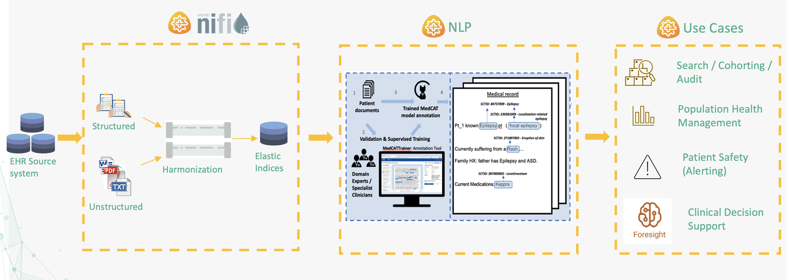

# CogStack Documentation

## What is CogStack?

CogStack is a lightweight distributed, fault tolerant database processing architecture and ecosystem, intended to make NLP processing and preprocessing easier in resource constrained environments. It comprises of multiple components, and has been designed to provide configurable data processing pipelines for working with EHR data. For the moment it mainly uses databases and files as the primary source of EHR data with the possibility of adding custom data connectors in the near future. It makes use of the [Apache-Nifi](https://nifi.apache.org/) framework in order to provide a fully configurable data processing pipeline with the goal of generating annotated JSON standardised schema files that can be readily indexed into [ElasticSearch](https://www.elastic.co/), stored as files or pushed back to a database.

The CogStack ecosystem has been developed as an open source project with the code available on GitHub: [https://github.com/CogStack/](https://github.com/CogStack/CogStack-Pipeline) .

> [!IMPORTANT]
> ### Tip
>
> Starting from version 1.2 CogStack is preferably being run as an ecosystem using a set of different microservices and deployed using [Docker Compose](https://docs.docker.com/compose/). The ready-to-use CogStack images are available to pull directly from the official Docker Hub under [cogstacksystems](https://hub.docker.com/u/cogstacksystems/) organisation. We’re actively pursuing running the stack in a K8s cluster also.

## Why does this project exist?

The CogStack consists of a range of technologies designed to to support modern, open source healthcare analytics within the NHS, and is chiefly comprised of the Elastic stack ([ElasticSearch](https://www.elastic.co/products/elasticsearch), [Kibana](https://www.elastic.co/products/kibana), etc.), [MedCAT](https://github.com/CogStack/MedCAT) (clinical natural language processing for named entity extraction and linking), clinical text [OCR](https://github.com/CogStack/ocr-service), clinical text de-identification. Since the processed EHR data can be represented and stored in databases or ElasticSearch, CogStack can be perfectly utilised as one of the solutions for integrating EHR data with other types of biomedical, -omics, wearables data, etc.

---