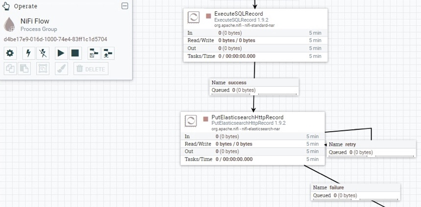

# Data pipelines

## Introduction

This page covers the data pipelines used in CogStack ecosystem.

> [!WARNING]
> Please note that CogStack-Pipeline was the initial implementation of CogStack platform and this pipeline engine is being deprecated – we are moving forward with porting the existing pipeline functionality using Apache NiFi as the main data processing engine (see below: **CogStack-NiFi**).

## CogStack-Pipeline

### Overview

CogStack-Pipeline is an application for executing data pipelines for performing EHR data ingestion from databases to ElasticSearch (primarily) or other databases. It implements a fixed set of ETL operations including extraction of text from binary documents using Apache Tika, running NLP applications based on [GATE NLP suite](https://gate.ac.uk/) and a custom de-identification application based on text scrubbing. It was build in Spring Batch and implements only a document-oriented data processing model. For a complete description on CogStack-Pipeline please refer to [the official documentation](https://cogstack.atlassian.net/wiki/spaces/COGDOC).

> [!IMPORTANT]
> The latest version of CogStack Pipeline is 1.3.1.

### Key resources

- Documentation: [https://cogstack.atlassian.net/wiki/spaces/COGDOC](/wiki/spaces/COGDOC)
- Deployment examples: [Examples](Examples.md)
- GitHub: <https://github.com/CogStack/CogStack-Pipeline>
- DockerHub: <https://cloud.docker.com/repository/docker/cogstacksystems/cogstack-pipeline>

## CogStack-NiFi

### Overview

|                                                                                                                                                                                                                                                                                                                                                                                                                                                                                                                                                                                                                                                                                                                                                                                                                                                                                                                                                                                                                                                                                                                                                                                                                                                                                                                                                                                                                                                                                                                                                                                                                                                                                                                                                                                                                                                                                                      |                                                              |
|:-----------------------------------------------------------------------------------------------------------------------------------------------------------------------------------------------------------------------------------------------------------------------------------------------------------------------------------------------------------------------------------------------------------------------------------------------------------------------------------------------------------------------------------------------------------------------------------------------------------------------------------------------------------------------------------------------------------------------------------------------------------------------------------------------------------------------------------------------------------------------------------------------------------------------------------------------------------------------------------------------------------------------------------------------------------------------------------------------------------------------------------------------------------------------------------------------------------------------------------------------------------------------------------------------------------------------------------------------------------------------------------------------------------------------------------------------------------------------------------------------------------------------------------------------------------------------------------------------------------------------------------------------------------------------------------------------------------------------------------------------------------------------------------------------------------------------------------------------------------------------------------------------------|:-------------------------------------------------------------|
| CogStack-NiFi is the re-architected version of CogStack-Pipeline that replaces the fixed Spring Batch-based pipeline engine with [Apache NiFi](https://nifi.apache.org/). It focuses on fully configurable and scalable data flows with the data processing engine that is easy to use, deploy and tailor to any site-specific data flow requirements. Apache NiFi also comes in with build-in monitoring, data provenance and security features that puts the operations in better control and reliability.   **CogStack-NiFi useful links:**  <ul><li>
GitHub: <a class="external-link" data-card-appearance="inline" href="https://github.com/CogStack/CogStack-NiFi" rel="nofollow">https://github.com/CogStack/CogStack-NiFi</a> 
</li><li>
Documentation with deployment examples: <a class="external-link" data-card-appearance="inline" href="https://github.com/CogStack/CogStack-NiFi/tree/devel/deploy" rel="nofollow">https://github.com/CogStack/CogStack-NiFi/tree/devel/deploy</a> 
</li><li>
Documentation on available services: <a class="external-link" data-card-appearance="inline" href="https://github.com/CogStack/CogStack-NiFi/tree/devel/services" rel="nofollow">https://github.com/CogStack/CogStack-NiFi/tree/devel/services</a> 
</li><li>
DockerHub: <a class="external-link" href="https://cloud.docker.com/repository/docker/cogstacksystems/cogstack-nifi" rel="nofollow">https://cloud.docker.com/repository/docker/cogstacksystems/cogstack-nifi</a>
</li></ul>    **Apache NiFi resources:**  <ul><li>
The official website: <a class="external-link" href="https://nifi.apache.org/" rel="nofollow">https://nifi.apache.org/</a>
</li><li>
The official documentation: <a class="external-link" href="https://nifi.apache.org/docs.html" rel="nofollow">https://nifi.apache.org/docs.html</a>
</li></ul>    |  |

> [!IMPORTANT]
> Please note that CogStack-NiFi project is still under active development with the newest version **0.1.0**.

### **Apache NiFi – overview**

*From the official documentation:* Apache NiFi is a dataflow system based on the concepts of flow-based programming. It supports powerful and scalable directed graphs of data routing, transformation, and system mediation logic. NiFi has a web-based user interface for design, control, feedback, and monitoring of dataflows. It is highly configurable along several dimensions of quality of service, such as loss-tolerant versus guaranteed delivery, low latency versus high throughput, and priority-based queuing. NiFi provides fine-grained data provenance for all data received, forked, joined cloned, modified, sent, and ultimately dropped upon reaching its configured end-state.

Some of the key features of Apache NiFi engine are:

- Highly configurable and extendable

  - Can build own data processors and modules that can be easily integrated into data pipeline
  - Enables rapid prototyping, development and effective testing
  - Data flows can be modified, inspected and troubleshoot at runtime
- Web-based user interface

  - Seamless experience between design, control, feedback, and monitoring of the data flows
- Data Provenance

  - Can track data flow from beginning to end for addressing information governance requirements
- Security

  - Support for SSL, SSH, HTTPS, encrypted content, etc.
  - Multi-tenant authorization and internal authorization/policy management

For a detailed description of Apache NiFi, it’s functionality and broad set of features please refer to [the official documentation](https://nifi.apache.org/docs.html) and [the official Apache NiFi website](https://nifi.apache.org/).

### Major changes from CogStack-Pipeline

There are some key major changes when using and deploying Apache NiFi as compared with CogStack-Pipeline.

One of the most important changes is the way how defining, configuring and monitoring data flows works. When using CogStack-Pipeline the ingestion jobs were defined in `.properties` files and were having very limited job execution monitoring and troubleshooting possibilities. Apache NiFi implements (an optional) web-based user interface that can be used to define data flows on drag-and-drop fashion with further configuration and monitoring capabilities. The data flow definitions can be saved and exported into XML format and later loaded into other instances of Apache NiFi or just kept under version control.

Each ingestion job that is being run by CogStack-Pipeline also requires a separate CogStack-Pipeline application instance. In Apache NiFi multiple data flows can be run in parallel each being managed by a single, main Apache NiFi data processing engine instance.

Moreover, one of the main limitations of CogStack pipeline has been support only for a document-centric data model for performing ingestion where each ingested record could only contain one document to be processed. Apache NiFi does not enforce document-centric data model and provides flexibility on defining custom data flows and data schemas. Handling multiple documents in a single record or using a patient-centric data model is a matter of tailoring the pipeline and defining or tailoring appropriate schema.

Moreover, fixed ETL operations (implemented as modules in CogStack-Pipeline) can be included as custom ETL scripts or application modules inside a defined Apache NiFi data flow. For example, the text extraction done by [Apache Tika](https://tika.apache.org/) and NLP functionality (such as running [MedCAT](https://github.com/CogStack/MedCATservice) or [GATE NLP](https://github.com/CogStack/gate-nlp-service) applications was implemented as external micro-services exposing that expose a REST API and hence can be used directly in the data flow. All the third-party application dependencies are handled by the external services that further allows for separating the responsibilities.

> [!IMPORTANT]
> Please note that the recommended minimal resources requirements for running Apache NiFi will be higher than for CogStack-Pipeline and these will depend on the actual use-case.

### Example deployment and services

Please see [CogStack-NiFI example deployment with workflow examples](https://github.com/CogStack/CogStack-NiFi/tree/devel/deploy) .
