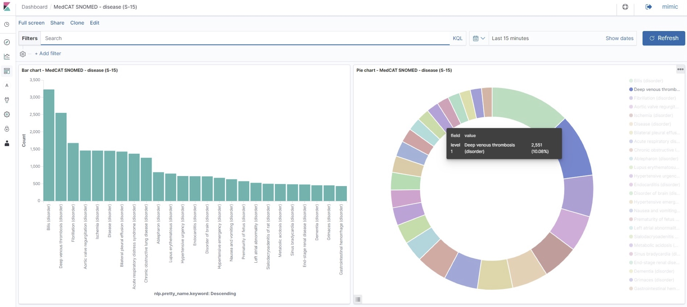

# Elasticsearch

# Introduction

In CogStack the Elasticsearch ecosystem is being used extensively. It plays a key role of being the main data store and one of the key analytics tools able to fast query the free-text data.

# Elasticsearch

[Elasticsearch](https://www.elastic.co/guide/) is a leading NoSQL search engine based on the Lucene library that provides a distributed full-text search engine storing the data as schema-free JSON documents. Inside CogStack platform it is usually used as a data store for processed EHR free-text and annotation data.

Depending on the use-case, the processed EHR data is usually stored in indices as defined in data pipeline jobs. Once stored, it can be easily queried either by using the own's REST API (see: [ElasticSearch Search API](https://www.elastic.co/guide/en/elasticsearch/reference/current/search-search.html)), queried using [Kibana](https://cogstack.atlassian.net/wiki/pages/resumedraft.action?draftId=17006639#CogStackplatform-platform-kibana) or queried using a ElasticSearch connector available in many programming languages. Elasticsearch apart from standard functionality and features provided in its open-source free version also offers more advanced ones distributed as [Elastic Stack](https://www.elastic.co/products/stack) (formerly: X-Pack extension) which require license. These include modules for machine learning, alerting, monitoring, advanced security and more.

**Key resources:**

- the official [practical introduction to Elasticsearch](https://www.elastic.co/blog/a-practical-introduction-to-elasticsearch)
- the official [Elasticsearch documentation](https://www.elastic.co/guide/)
- the official [Elasticsearch use-case examples](https://github.com/elastic/examples)

# OpenDistro for Elasticsearch distribution

[OpenDistro for Elasticsearch](https://opendistro.github.io/for-elasticsearch/) is a fully open-source, free and community-driven fork of Elasticseach. It implements many of the X-pack components functionality, such as advanced security module, alerting module or SQL support. Nonetheless, the standard core functionality and APIs the official Elasticsearch and OpenDistro remain the same. Hence OpenDistro can be used as a drop-in replacement.

**Key resources:**

- [the official website](https://opendistro.github.io/for-elasticsearch/)
- the official [OpenDistro for Elasticsearch documentation](https://opendistro.github.io/for-elasticsearch-docs/)

> [!TIP]
> For example use and deployment of CogStack with Elasticsearch please see the tutorial: [CogStack using Apache NiFi Deployment Examples](https://github.com/CogStack/CogStack-NiFi/tree/devel/deploy)

# Kibana

[Kibana](https://www.elastic.co/products/kibana) is a data visualisation application for Elasticsearch that be easily used to explore and query the data. In sample CogStack platform deployments it can be used as a ready-to-use data exploration tool.

Apart from providing exploratory data analysis functionality it also offers administrative options over the ElasticSearch data store, such as adding/removing/updating the documents using command line or creating/removing indices. Moreover, custom user dashboards can be created according to use-case requirements. For a more detailed description of the available functionality please refer to the [official documentation](https://www.elastic.co/guide/en/kibana/current/introduction.html).

Below is presented an example dashboard.

# Security

OpenDistro implements many of the commercial X-Pack components functionality, such as advanced security module, alerting module or SQL support. Some of the features include:

- Preventing unauthorised access with password protection, role-based access control (even per index- or single document-level), and IP filtering.
- Preserving the integrity of your data with message authentication and SSL/TLS encryption.
- Maintaining an audit trail so one know who’s doing what to your cluster and the data it stores.

The security aspects and configuration are covered extensively in [the official OpenDistro for Elasticsearch documentation](https://opendistro.github.io/for-elasticsearch-docs/).
