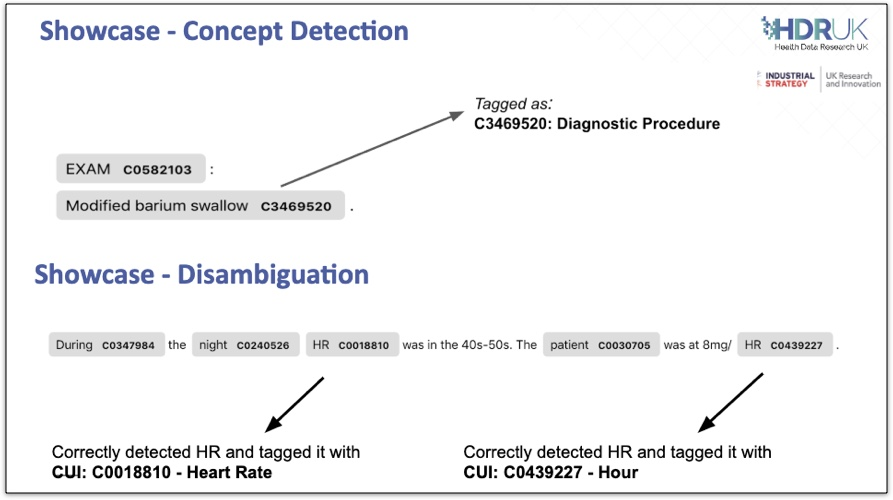
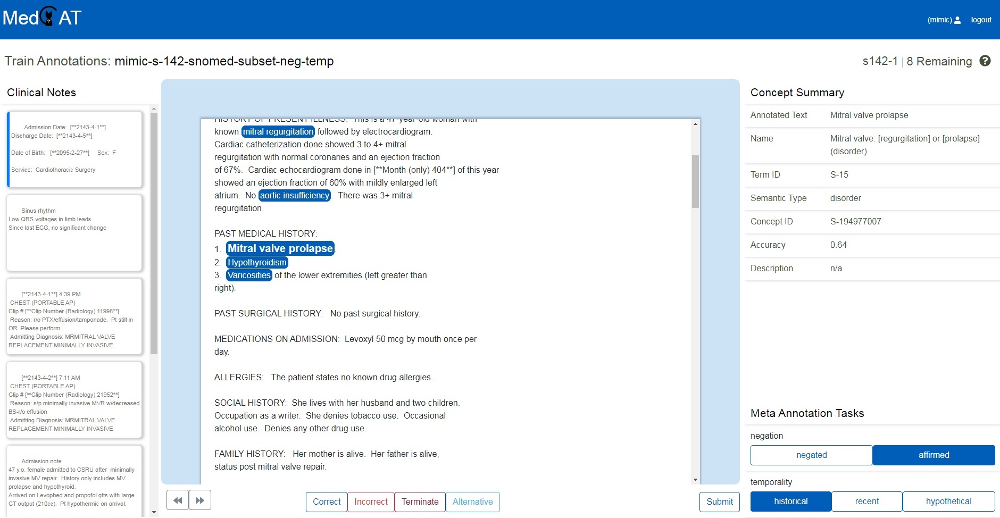

# Natural Language Processing

## Overview

CogStack ecosystem provides a standard set of natural language processing applications that are used either as standalone applications or implemented as RESTful services with uniform API, each running in a Docker container. These NLP applications when used inside the data processing pipeline cover one of the key steps of information extraction. These NLP applications may include extracting medical concepts from free-text notes using a specific terminology, such as [SNOMED CT](https://en.wikipedia.org/wiki/SNOMED_CT) or using all the terminologies as available in [UMLS](https://www.nlm.nih.gov/research/umls/index.html). Often, more specialised applications will be built on top of the standard set of NLP applications provided in CogStack, utilising both structured and unstructured information tailored to a defined use-case. These custom applications can be further integrated into CogStack and used as a part of standard set of NLP applications.

:::{tip}
Please see [CogStack using Apache NiFi Deployment Examples](https://github.com/CogStack/CogStack-NiFi/tree/devel/deploy) to see how to integrate NLP services in example data pipelines.
:::

:::{tip}
Apart from being integrated directly in the data processing pipeline, many NLP applications are often used as standalone applications and have a rich set of tools build around them – please see below for more details.
:::

## MedCAT - Medical Concept Annotation Tool

### Overview

One of the key tools is MedCAT – a Medical Concept Annotation Tool that is used for Named Entity Recognition and Linking (NER+L) tasks for clinical concepts from free-text documents.

|                                                                                                                                                                                                                                                                                                                                                                                                                                                                                                                                                                                                                                                                                                                                                                                                                                                                                                                                                                                                                                                                                                                                       |                                                              |
|:--------------------------------------------------------------------------------------------------------------------------------------------------------------------------------------------------------------------------------------------------------------------------------------------------------------------------------------------------------------------------------------------------------------------------------------------------------------------------------------------------------------------------------------------------------------------------------------------------------------------------------------------------------------------------------------------------------------------------------------------------------------------------------------------------------------------------------------------------------------------------------------------------------------------------------------------------------------------------------------------------------------------------------------------------------------------------------------------------------------------------------------|:-------------------------------------------------------------|
| MedCAT is based on a light-weight neural network that calculates vector embeddings and that is used for disambiguation and concept detection. MedCAT also uses Deep Learning Language Model that is used for detection of negation, experiencer or any other type of classification. <br/> MedCAT can utilise a concepts dictionary with a vocabulary provided by the end-user that will be used to perform annotate the concepts in the clinical notes. The provided concepts dictionary can be e.g., SNOMED CT terminology or full/ subset of UMLS resource. Apart from providing the vocabulary and concepts dictionary, the underlying MedCAT model can be further trained and fine-tuned for performing context-aware concept disambiguation with additional meta-annotations tasks. MedCAT be run also directly with pre-trained models. <br/> **MedCAT** can be used either as a standalone Python module, as a part of a model trainer application **MedCAT Trainer** or be deployed as a RESTful **MedCAT Service** inside a data processing pipeline. Below are briefly covered possible ways of working with MedCAT. <br/> |  |

:::{WARNING}
Please note that we only provide few basic models for MedCAT that have been prepared using open datasets. Some of the used models are restricted by the external licensing of the resource that was used to build it, such as SNOMED CT or UMLS. In such cases, the user needs to apply for an appropriate license – please see: [UMLS licensing](https://www.nlm.nih.gov/research/umls/knowledge_sources/metathesaurus/release/license_agreement.html) and [SNOMED CT licensing](http://www.snomed.org/snomed-ct/get-snomed).
:::

:::{IMPORTANT}
When deploying MedCAT into data processing pipelines one may be interested in training and tailoring the MedCAT models as a part of model preparation. This can be done directly by using MedCAT Trainer or MedCAT library working with a corpus of input documents. Such trained model can be in the next step provided into MedCAT Service that will be deployed as a service and used in the data pipeline.
:::

### MedCAT Python module

Key resources:

- GitHub repository with code and documentation: <https://github.com/CogStack/MedCAT>
- MedCAT publication: <https://arxiv.org/abs/1912.10166>
- Tutorial on MedCAT: [MedCAT – Analysing Electronic Health Records](https://towardsdatascience.com/medcat-introduction-analyzing-electronic-health-records-e1c420afa13a) (in a series of articles)
- PIP repository: <https://pypi.org/project/medcat/>

:::{tip}
The MedCAT Python library is the functional core of MedCAT project. The library is used by MedCAT Trainer when training and updating the models. It is also used within the MedCAT Service that exposes the medical concepts extraction functionality.
:::

## MedCAT Trainer

|                                                                                                                                                                                                                                                                                                                                                                                                                                                                                                                                                                                                                                                                                                                                                                                                                                                                                                                                                                                                                                                                                                                                         |                                                                     |
|:----------------------------------------------------------------------------------------------------------------------------------------------------------------------------------------------------------------------------------------------------------------------------------------------------------------------------------------------------------------------------------------------------------------------------------------------------------------------------------------------------------------------------------------------------------------------------------------------------------------------------------------------------------------------------------------------------------------------------------------------------------------------------------------------------------------------------------------------------------------------------------------------------------------------------------------------------------------------------------------------------------------------------------------------------------------------------------------------------------------------------------------|:--------------------------------------------------------------------|
| MedCAT Trainer is an interface for building, improving and customising a given Named Entity Recognition and Linking models for biomedical domain text. <br/> The models trained by MedCAT Trainer can be later used directly with custom Python applications using on MedCAT module. Alternatively, the models can be deployed in data pipelines, e.g. behind a RESTful API via MedCAT Service. <br/> **Key resources:** <br/><ul><li><p>GitHub repository with code and documentation: <a class="external-link" data-card-appearance="inline" href="https://github.com/CogStack/MedCATTrainer" rel="nofollow">https://github.com/CogStack/MedCATTrainer</a> </p></li><li><p>MedCAT Trainer publication: <a class="external-link" href="https://arxiv.org/abs/1907.07322" rel="nofollow">https://arxiv.org/abs/1907.07322</a></p></li><li><p>Tutorial on using MedCAT Trainer: <a class="external-link" href="https://towardsdatascience.com/medcattrainer-a-tool-for-inspecting-improving-and-customising-medcat-880a11297ebe" rel="nofollow">MedCATTrainer: A Tool For Inspecting, Improving and Customising MedCAT</a></p></li></ul> |   <br/> |

## MedCAT Service

MedCAT Service implements a RESTful API over MedCAT module to perform extraction of concepts from provided text. Usually, a single instance of MedCAT Service will be serving a single MedCAT model. Such model can be later deployed in data processing pipelines. The API specification is provided in the sections below.

Key resources:

- GitHub repository with code, documentation and use examples: <https://github.com/CogStack/MedCATservice>

:::{tip}
Please note that there is available public MedCAT model trained on MedMentions corpus that can be used to play with.
:::

## GATE NLP applications

### Overview of GATE NLP suite

[GATE NLP suite](https://gate.ac.uk/) is a well established and rich set of open-source technologies implementing full-lifecycle solution for text processing. The GATE ecosystem is very broad and outside of the scope of this documentation – here we will only focus on two applications:

- [GATE Developer](https://gate.ac.uk/family/developer.html),
- [GATE Embedded](https://gate.ac.uk/family/embedded.html).

GATE Developer is a development environment that provides a large set of graphical interactive tools for the creation, measurement and maintenance of software components for natural language processing. It allows to design, create and run NLP applications using an intuitive user interface. These applications can be later exported as a custom *gapp* or *xgapp* application with the used resources.

GATE Embedded, on the other hand, is an object-oriented framework (or class library) implemented in Java. It is used in all GATE-based systems, and forms the core (non-visual) elements of GATE Developer. In principle, it implements the runtime for executing GATE applications. It allows to run the *gapp* and *xgapp* applications that have been previously created in GATE Developer.


:::{IMPORTANT}
When deploying GATE applications within CogStack one may be interested in defining and tailoring custom GATE applications directly by using GATE Developer. Such prepared application can be in the next step provided into CogStack **GATE NLP Runner Service** that uses GATE Embedded to execute GATE applications. This way, provided NLP application can be deployed as a service and used in the data pipeline.
:::

Although there have been developed and published many applications in GATE NLP suite, in this page we only briefly cover Bio-YODIE.

### Bio-YODIE

Bio-YODIE is a named entity linking system derived from GATE YODIE system. It links mentions in biomedical text to their referents in the UMLS. It defines a broad set of types such as `Disease` , `Drug`, `Observation` and many more all of the types belonging to `Bio` group – for detailed information please refer to [the official documentation](https://gate.ac.uk/applications/bio-yodie.html).

Bio-YODIE can be run either within GATE Developer application or as a service within CogStack (based on GATE Embedded and running as a Service). Here we primarily focus on the latter and refer the reader to the official Bio-YODIE website.

**Key resources:**

- The official website: <https://gate.ac.uk/applications/bio-yodie.html>
- GitHub repository with application code: <https://github.com/GateNLP/Bio-YODIE>
- GitHub repository with code to prepare UMLS resources for Bio-YODIE: <https://github.com/GateNLP/bio-yodie-resource-prep>

:::{WARNING}
Please note that Bio-YODIE requires resources to be prepared using UMLS. These are limited by individual license and cannot be openly shared.
:::

### GATE NLP Runner service

CogStack implements a GATE NLP Runner service that serves the GATE NLP applications as a service exposing RESTful API. It is using GATE Embedded to execute the GATE applications that are provided either in *gapp* or *xgapp* format. The API specification is provided in the sections below.

For more information please refer to the official GitHub with code and documentation: <https://github.com/CogStack/gate-nlp-service>

## NLP REST API

CogStack defines a simple, uniform, RESTful API for free-text documents processing. It’s primary focus has been on providing an application independent and uniform interface for extracting entities from the free-text. The data exchange should be stateless and synchronous. The use-case is: given a document (or a corpus of documents) extract the recognised named entities with associated meta-data. This way, any NLP application can be used or any NLP model can be served in the data processing pipeline as long as it stays compatible with the interface.

### REST API definition

The API defines 3 endpoints, that consume and return data in JSON format:

- *GET* `/api/info` - displays general information about the the NLP application,
- *POST* `/api/process` - processes the provided single document and returns back the annotations,
- *POST* `/api/process_bulk` - processes the provided list of documents and returns back the annotations.

The full definition is available as [OpenAPI or Swagger](https://github.com/CogStack/gate-nlp-service/tree/devel/api-specs) specification.

#### GET `/api/info`

Returns information about the used NLP application. The returned fields are:

- `name`, `version`, `language` of the underlying NLP application
- `parameters` – a generic JSON object representing any relevant parameters that have been specified to the application (optional)

#### POST `/api/process`

Returns the annotations extracted from the provided document.

The request message payload JSON consists of following objects

- `content` that represents the single document content to be processed
- `applicationParams` – a generic JSON object representing NLP application run-time parameters (optional)

The single document processing `content` (\*\*\*) has following keys :

- `text` – the document to be processed
- `metadata` – a generic JSON object representing any relevant metadata associated with the document that will be consumed by the NLP application (optional)
- `footer` – a generic JSON object representing a payload footer that will be returned back with the result (optional)

The response message payload JSON consists of an object `result` that has following fields:

- `text` – the input document that was processed (optional)
- `annotations` – an array of generic JSON annotation objects, not enforcing any schema
- `metadata` – a metadata associated with the processed document that was reported by the NLP application (optional)
- `success` – boolean value indicating whether the NLP processing was successful
- `timestamp` – document processing timestamp
- `errors` – an array of NLP processor errors (present only in case when `success` is `false`)
- `footer` – the footer object as provided in the request payload (present only when provided in the request message)

#### POST `/api/process_bulk`

Returns the annotations extracted from a list of documents.

The request message payload JSON consists of following objects

- `content` – an array of documents content to be processed
- `applicationParams` – a generic JSON object representing NLP application run-time parameters (optional)

Here, the `content` object holds an array of single document content to be processed as defined above in (\*\*\*).

### Example use

:::{tip}
Please see [CogStack using Apache NiFi Deployment Examples](https://github.com/CogStack/CogStack-NiFi/tree/devel/deploy) to see how to deploy example NLP services, i.e. MedCAT with a public MedMentions model and example GATE NLP Drug application.
:::

#### MedCAT

Assuming that the application is running on the `localhost` with the API exposed on port `5000`, one can run:

```java
curl -XPOST http://localhost:5000/api/process \
  -H 'Content-Type: application/json' \
  -d '{"content":{"text":"The patient was diagnosed with leukemia."}}'

```

and the received result:

```java
{
  "result": {
    "text": "The patient was diagnosed with leukemia.",
    "annotations": [
      {
        "pretty_name": "leukemia",
        "cui": "C0023418",
        "tui": "T191",
        "type": "Neoplastic Process",
        "source_value": "leukemia",
        "acc": "1",
        "start": 31,
        "end": 39,
        "info": {},
        "id": "0",
        "meta_anns": {}
      }
    ],
    "success": true,
    "timestamp": "2019-12-03T16:09:58.196+00:00"
  }
}
```

### Bio-YODIE

Bio-YODIE is being run as a service using CogStack GATE NLP Runner Service as described above. In this example Bio-YODIE application will only output annotations of `Disease` type from `Bio` group (defined in the service configuration file). Assuming that the service is running on the `localhost` with the API exposed on port `8095`, so one can run:

```java
curl --header "Content-Type: application/json" \
  --request POST \
  --data '{"content":{"text": "lung cancer diagnosis"}}' \
  http://localhost:8095/api/process
```

and the received result:

```java
{
  "result": {
    "text": "lung cancer diagnosis",
    "annotations": [
      {
        "end_idx": 11,
        "set": "Bio",
        "Negation": "Affirmed",
        "Experiencer": "Patient",
        "PREF": "Lung Cancer",
        "end_node_id": "17",
        "TUI": "T191",
        "language": "",
        "start_node_id": "16",
        "type": "Disease",
        "LABELVOCABS": "CHV,MEDLINEPLUS,MSH",
        "CUIVOCABS": "MTH,CHV,MSH,SNOMEDCT_US,NCI,LCH_NW,OMIM,MEDLINEPLUS,COSTAR,NCI_CTRP-SDC",
        "inst_full": "http://linkedlifedata.com/resource/umls/id/C0242379",
        "inst": "C0242379",
        "string_orig": "lung cancer",
        "STY": "Neoplastic Process",
        "start_idx": 0,
        "id": 18,
        "text": "lung cancer",
        "Temporality": "Recent",
        "tui_full": "http://linkedlifedata.com/resource/semanticnetwork/id/T191"
      }
    ],
    "metadata": {
      "document_features": {
        "keyOverlapsOnly": false,
        "gate.SourceURL": "created from String",
        "docType": "generic",
        "deleteNonNNPLookups": "true",
        "lang": "en"
      }
    },
    "success": true,
    "timestamp": "2019-12-03T16:10:13.281+00:00"
  }
}
```

### Extra: a simple GATE-based drug names extraction application

As an extra example, a simple application for extracting drug names from the free-text was developed in GATE Developer using ANNIE Gazetteer. It uses as an input the data downloaded from [Drugs@FDA database](https://www.accessdata.fda.gov/scripts/cder/daf/) and further refined giving a curated list of drugs and active ingredients. The application functionality is exposed using CogStack GATE NLP Runner Service.

Similarly as in above, assuming that the application is running on the `localhost` with the API exposed on port `8095`, one can run:

```java
curl -XPOST http://localhost:8095/api/process \
  -H 'Content-Type: application/json' \
  -d '{"content":{"text":"The patient was prescribed with Aspirin."}}'

```

and the received result:

```java
{
  "result": {
    "text": "The patient was prescribed with Aspirin.",
    "annotations": [
      {
        "end_idx": 39,
        "majorType": "Drug",
        "set": "",
        "name": "ASPIRIN",
        "start_idx": 32,
        "language": "",
        "id": 12,
        "minorType": "ActiveComponent",
        "text": "Aspirin",
        "type": "Drug"
      },
      {
        "end_idx": 39,
        "majorType": "Drug",
        "set": "",
        "name": "ASPIRIN",
        "start_idx": 32,
        "language": "",
        "id": 13,
        "minorType": "Medication",
        "text": "Aspirin",
        "type": "Drug"
      }
    ],
    "metadata": {
      "document_features": {
        "gate.SourceURL": "created from String"
      }
    },
    "success": true,
    "timestamp": "2019-12-04T09:51:32.246Z"
  }
}
```
