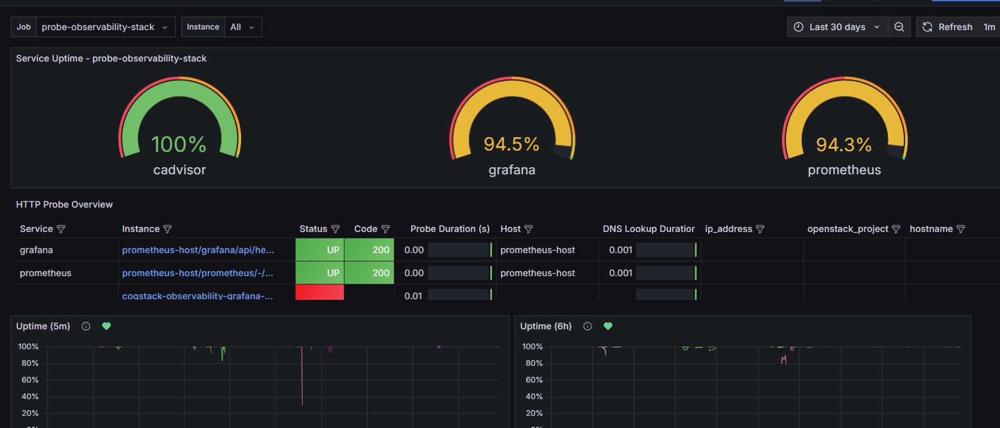
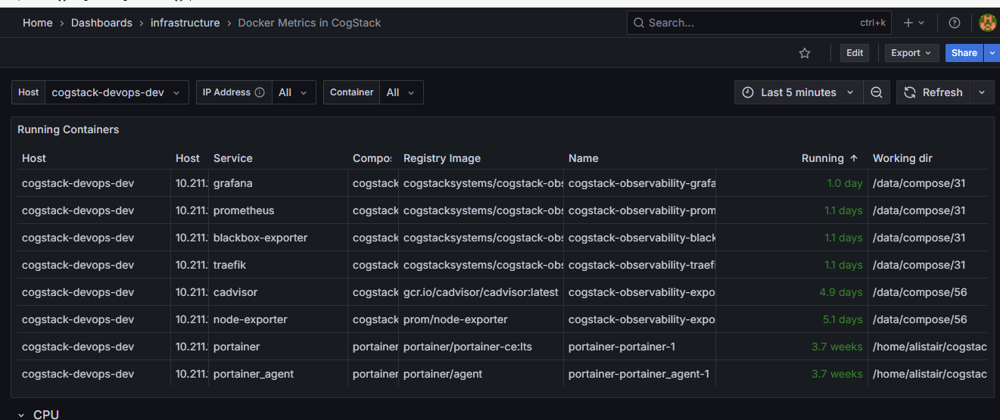
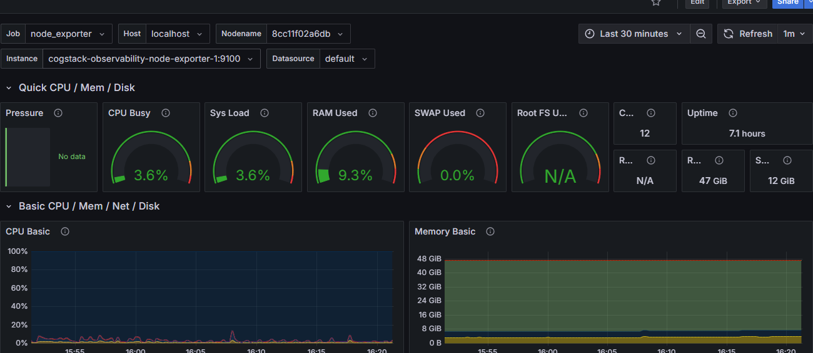
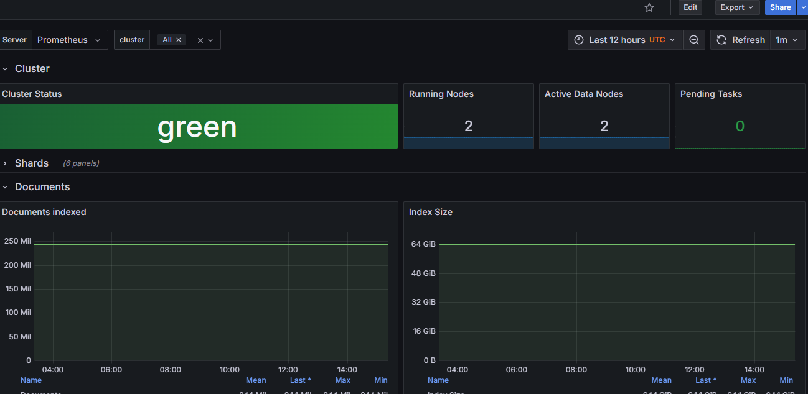
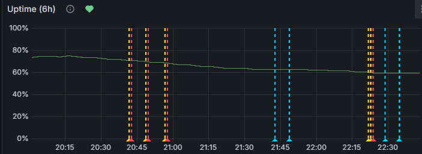

# Dashboard User Guide
This guide walks you through how to monitor your stack using the included Grafana dashboards. It shows how to use each dashboard, and some ideas of what things to look out for.

## Availability - How well are things running?

Open the Cogstack Monitoring Dashboard on [localhost/grafana](http://localhost/grafana/d/NEzutrbMk/cogstack-monitoring-dashboard) 

Use the percentage uptime charts at the top to see the availability over a given time period. For example, “Over the last 8 hours, we have 99.5% availability on my service”. 

Use the time filter in the top right corner of the page to change the window, for example change it to 30 days to see availability for the total month. 

Look for trends like:
- Has there been a full outage of a service for 5 minutes, where where 5m availability goes to 0
- Is there some disruption over the time period, where my 5m availability stays high, but my 6h availability is going down?
- Have we met the service level objective, if we set the time threshold to 30 days? 

Use the filters at the top, or click in the table to better filter the view down to specific targets, services or hosts. 

See [Setup Probing](../setup/probing.md) to do the full setup of probers.

## Inventory - What is running? 

Use the Docker Metrics dashboard to check which containers are running, where, and whether they're healthy. This is useful for verifying deployments or diagnosing issues.

The dashboard above includes the hostnames, IP addresses and any other details configured. 

Check for things like:
- Containers not running where you thought they should be by looking at the hostname for each container
- Containers restarting unexpectedly, by looking at the "Running" column in the table

See [telemetry](../setup/telemetry.md) to set this up

## Telemetry - How can I see details of resources?
Some additional dashboards are setup to provide more metrics.

### VM Metrics

Open the VM Metrics dashboard on [localhost/grafana](http://localhost/grafana/d/rYdddlPWk/vm-metrics-in-cogstack)

Select a VM from the host dropdown .

Look for things like:

- CPU Usage — is a process using too much CPU?
- Memory Usage — if you're running out of RAM 
- Disk IO / Space — alerts you to low disk conditions
- Trends over time, by setting the time filter to 30 days. Is your disk usage increasing over time?

### Elasticsearch Metrics

Open the Elasticsearch Metrics dashboard on [localhost/grafana](http://localhost/grafana/d/n_nxrE_mk/elasticsearch-metrics-in-cogstack)

This dashboard helps you understand how your ElasticSearch or Opensearch cluster is behaving. 

Look at:
- Cluster health status — shows yellow/red states immediately
- Index size per shard — to detect unbalanced index growth
- Query latency and throughput — useful during heavy search loads

See [telemetry](../setup/telemetry.md) to set this up

## Alerting - When should I look at this?
Alerting is setup using Grafana Alerts, but paused by default

When alerts are setup, the grafana graphs will show when the alerts were fired.

Two sets of rules are defined in this project:

- Basic alerts using uptime. If over 5m or 6h, if it drops below a certain percentage uptime, send an alert
- Alerting on SLOs by using burn rates, for multi-window multi-rate alerts following best practices defined in [Google SRE - Prometheus Alerting: Turn SLOs into Alerts](https://sre.google/workbook/alerting-on-slos/) 

See [Alerting](../setup/alerting.md) to set this up
